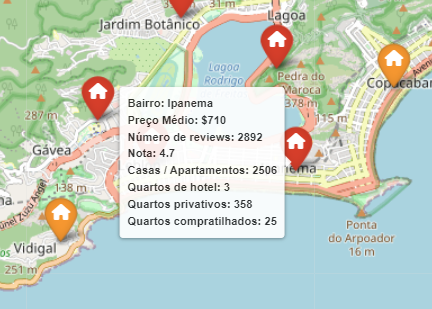
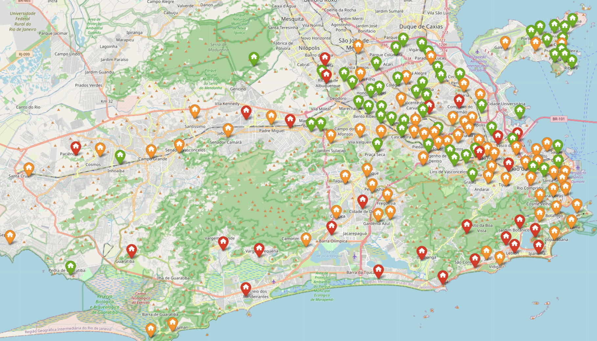

# **Análise AirBNB Rio de Janeiro 2023**
Nesse projeto, eu tive como objetivo criar um mapa geográfico com ícones representando os bairros e tooltips fornecendo todas as informações relevantes do bairro selecionado.

Para realização desse projeto, eu utilizei as bibliotecas numpy, pandas, matplotlib, seaborn e folium.

Dataset: http://insideairbnb.com/get-the-data/

  

Cores dos ícones  
Vermelho - Acima da média de preços  
Amarelo - Próximo à média de preços  
Verde - Abaixo da média de preços
  
**Qualquer contribuição é bem vinda!**
